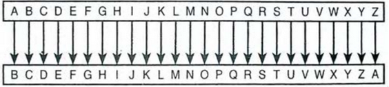

# A Cifra de César
A criptografia é uma técnica amplamente utilizada para proteger a confidencialidade e integridade das informações transmitidas ou armazenadas. Nesse contexto, uma das técnicas de encriptação mais antigas é a Cifra de César, nomeada assim em homenagem ao Imperador Júlio César, que empregava tal método para comunicar-se com seu exército de forma segura.

A ideia fundamental por trás do método é o deslocamento e substituição. O deslocamento é determinado por uma chave ($c$) que indica quantas posições cada letra do texto original é movida no alfabeto. Assim, substituímos cada letra do texto original pela letra que está localizada $c$ posições à frente no alfabeto.

Por exemplo, se a $c = 3$, a letra 'A' seria substituída por 'D', 'B' por 'E', e assim por diante. A imagem abaixo ilustra o deslocamento para $c = 1$.

# Tarefa
O objetivo deste VPL é trabalhar conceitos relacionados à manipulação de strings e argumentos de linha de comando em C++.

Como um entusiasta da segurança e da privacidade, sua missão é desenvolver um programa que possibilite a criptografia de textos por meio da Cifra de César.

O seu programa deve receber três argumentos, na seguinte ordem:
1. Um char que deve assumir um de dois valores: 'c' se a operação a ser realizar é a cifragem, ou 'd' se a operação for a de decifragem;
2. Um inteiro que indica o deslocamento;
3. O texto que deve ser cifrado ou decifrado.

Por exemplo:
> ./programa.exe d -1234 "gmu, fg qt ogduaea yqeya quz"

1. 'd' indica a operação de decifragem
2. '-1234' é o deslocamento
3. o texto entre aspas é o conteúdo que deve ser decifrado

# Regras do jogo
1. Você não deve cifrar caracteres especiais, ou seja, cifre apenas letras maiúsculas e minúsculas que não estejam acentuadas. Também não cifre o 'ç' ou números. Em suma, cifre somente as letras do alfabeto inglês.

2. Seu programa deve lidar com deslocamentos negativos (vide exemplo 2).

3. O seu programa deve receber os três parâmetros como argumentos de linha de comando (veja o link 3).

# Exemplos de entrada e saída
Considerando que o executável gerado pela compilação do seu programa chama-se "programa.exe", os exemplos abaixo ilustram o que é esperado para essa tarefa.
## Exemplo 1
### Cifragem
**input**
> ./programa.exe c 42 "42 é a resposta para tudo"

**output**
> 42 é q huifeijq fqhq jkte

### Decifragem
**input**
> ./programa.exe d 42 "42 é q huifeijq fqhq jkte"

**output**
> 42 é a resposta para tudo

## Exemplo 2
### Cifragem
**input**
> ./programa.exe c -5 "Linux > Windows"

**output**
> Gdips > Rdiyjrn

### Decifragem
**input**
> ./programa.exe d -5 "Gdips > Rdiyjrn"

**output**
> Linux > Windows

## Exemplo 3
### Cifragem
**input**
> ./programa.exe c -2000 "Programação e Desenvolvimento de Software 2"

**output**
> Rtqitcocçãq g Fgugpxqnxkogpvq fg Uqhvyctg 2

### Decifragem
**input**
> ./programa.exe d -2000 "Rtqitcocçãq g Fgugpxqnxkogpvq fg Uqhvyctg 2"

**output**
> Programação e Desenvolvimento de Software 2

# Links não tão inúteis
1. https://en.wikipedia.org/wiki/Caesar_cipher
2. https://www.ime.usp.br/~pf/algoritmos/apend/ascii.html
3. https://www.geeksforgeeks.org/command-line-arguments-in-c-cpp/
4. https://runestone.academy/ns/books/published/thinkcpp/Chapter2/OperatorsforCharacters.html
5. https://cplusplus.com/reference/string/string/
