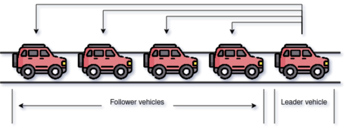

# WARNING: VPL is under construction
# Connected and Autonomous Vehicles
CAVs são veículos que incorporam tanto a tecnologia de veículos conectados, isto é, são capazes de trocar informações entre si, como também a tecnologia de serem autônomos. A união dessas duas tecnologias permite que os veículos formem pelotões que planejam manobras em conjunto para atingir um certo objetivo, além de trazer outros benefícios, como a segurança e a eficiência no transporte.

Um pelotão de CAVs é formado por um veículo líder e os veículos seguidores. A responsabilidade do líder é enviar comandos para os veículos seguidores, como o de acelerar, frear, alinhar com o pelotão etc. A imagem abaixa ilustra um pelotão de 5 CAVs.

# Tarefa
O objetivo deste VPL é trabalhar conceitos relacionados ao desenvolvimento de classes em C++, especificamente encapsulamento e herança.

Como um engenheiro e, principalmente, como um entusiasta dos carros autônomos, sua tarefa é implementar um programa que simula **um único** pelotão de CAVs em uma via. Cada veículo deve conter um ID, que deve ser um número inteiro positivo e deve ser sequencial. Assim, o veículo com ID zero será o líder e os demais serão seguidores.

## O que você deve implementar
### Point
Classe responsável por representar um ponto no plano, ou seja, deve conter os atributos necessários para armazenar coordenadas.

#### Atributos
1. **m_x**, **m_y** do tipo double, utilizado para armazenar as coordenadas.

#### Métodos
1. Point(double, double): Construtor que recebe os parâmetros x e y, nessa ordem, e inicializa os atributos da classe;
2. SetX(double) e SetY(double): Métodos para definir um novo valor para os atributos;
3. GetX() e GetY(): Métodos para obter os valores dos atributos.

### Vehicle
Classe responsável por representar nossos queridos CAVs. Essa classe deve ser uma classe derivada de **Point**.

#### Atributos
1. **m_id** do tipo std::size_t (veja o link 2), utilizado para armazenar o ID do veículo;
2. **m_speed** do tipo double, que deve armazenar a velocidade atual;
3. **m_limitSpeed** do tipo double, que indica a velocidade máxima que um veículo pode ter;
4. **m_acceleration** do tipo double, que indica a aceleração do veículo.

#### Métodos
1. Vehicle(std::size_t id, double x, double y, double limitSpeed, double acceleration): Construtor que recebe e inicializa os atributos da classe
2. SetSpeed(double), SetAcceleration(double): Métodos utilizados para alterar os atributos da classe;
3. GetID(), GetSpeed(), GetAcceleration()

OBS.: Se você estiver apanhando para inicializar os atributos da classe base (Point) através do construtor de Vehicle, o link 3 pode iluminar a sua vida.

### Platoon
Essa classe é a responsável por armazenar os veículos do pelotão e coordená-los, simulando o envio de informações do veículo líder para os seguidores. Como sugestão, você pode armazenar os veículos em um vector.

### Freedom
Além disso, você é livre para implementar

### main
O main já foi implementado é você pode (e provavelmente deva) copiá-lo para testar o seu programa localmente. A ideia é que vocês implementem somente os TADs, simulando o caso em que sua implementação será utilizada por outra pessoa (que conhece apenas o contrato).

# Regras do jogo
1. Todos os atributos de todas as classes devem ser encapsulados e serem acessados somente através de métodos Get e Set.

# Exemplos de entrada e saída
## Exemplo 1
**input**

**output**

## Exemplo 2
**input**

**output**

## Exemplo 3
**input**

**output**

## Exemplo 4
**input**

**output**

# Links não tão inúteis

1. https://onlinelibrary.wiley.com/doi/10.1002/asmb.2772
   - Se estiver curioso sobre CAVs, comece por este artigo, foi um dos mais legais que li durante a minha iniciação científica.
2. https://en.cppreference.com/w/cpp/types/size_t
3. https://stackoverflow.com/questions/6923722/how-do-i-call-the-base-class-constructor
